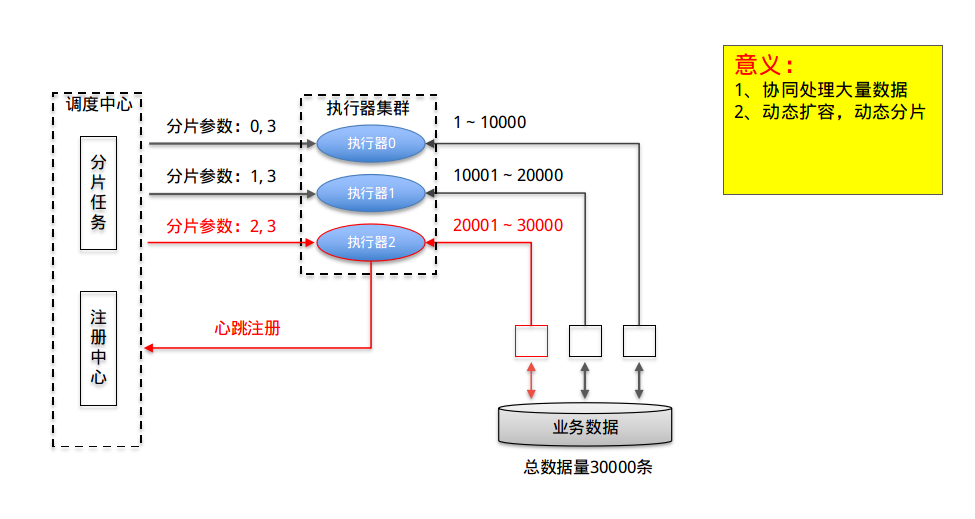
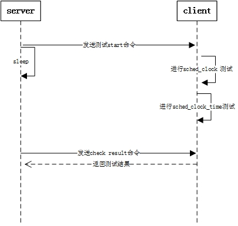

# SF自动化测试

TAG： Autotest

---

>**历史版本**
>|版本号|作者|修改日期|修改说明|
>|---|---|---|---|
>|V1.0|夏勤，沈城，覃能俊|2018-03-15|初始版本（参考版，需修改）|

## 自动化测试框架
**简介**：自动化测试平台由远程调度平台、本地客户端以及APP端组成，相互之间以socket通信为基础，通过在网页上安排测试可形成平台——>客户端——>平台，平台——>APP——>客户端——>平台，平台——>APP——>服务器——>客户端——>平台的完整测试链路，全面覆盖系统、服务、WIFI、APP等测试项目。

### 1.平台端介绍
  平台来源于github开源项目xxl-job，是一个轻量级分布式任务调度框架。其原理图如下：（可补充@沈城）
  
    
### 2.客户端介绍
  客户端为本地路由上创建的一个自启服务，负责监听远程调度请求并调度测试脚本执行测试，执行完后返回测试结果。每一个测试对应一个处理线程，支持并发。
        
### 3. app端介绍
        软件架构（jim写）

### 4. 代码仓库
源码：git clone ssh://UserName@192.168.1.10:29428/openwrt/siflower/auto_test

### 5. 测试流程介绍
  通过在远程调度平台上创建安排任务，发送测试命令到本地客户端（路由器），本地客户端起一个服务监听处理命令，调用测试脚本执行测试，测试完成后由客户端服务返回测试结果；如果包含APP测试则现将测试命令发送到APP，由APP调用测试接口后，返回测试结果到客户端，最终由客户端返回结果到平台。

## 如何开发一个自动化测试case

### 1. 本地测试开发
  编写可单独运行的测试脚本，由于测试脚本由本地客户端负责调用，所以需要固定的开始和结束格式。如果本地测试没有问题，可将测试脚本上传至服务器，路由器每次更新镜像时会从服务器拉取最新的测试脚本。

### 2. 服务端测试开发
  在平台端需先创建一个测试case，键入测试路由IP、测试时间和测试模式等，仿照其他测试case按固定格式编写Python脚本，负责远程调度和结果收集。

### 3. 测试case调试和分析
  测试case在正式发布前需先经过本地测试，如果测试出现问题，可先在网站上查看调度日志查看调度脚本是否有问题，测试脚本是否被调度，如果测试脚本正确被调度，可在客户端（路由器）上接串口或SSH登录，重启客户端自动化测试服务查看客户端log，查看脚本运行是否出现问题，按照调度流程，一步步排查即可。

## 自动化测试日常执行机制
### 1. 路由器版本自动升级过程
  自动化测试第一步就是进行OTA升级测试，它会调用本地OTA接口到镜像网站上拉取最新镜像进行升级，如果检测到当前镜像已是最新版本就不升级，反之会更新镜像。升级镜像为包含自动化测试服务的镜像，自动化测试服务会自主启动，检测到没有自动化测试脚本目录时，会去服务器拉取最新测试脚本并重新监听平台请求。

### 2. 平台测试集合配置和执行
  平台根据执行器不同分为不同测试项目，每个项目中的测试case根据输入参数不同进行配置，每个测试case对应一个或多个测试路由，case之间通过子key串联，将第一个case执行时间设置为晚上12:00并启用，到时间会串行自动执行所有串联case；项目之间可并行执行也可通过子key串联，目前我们采用的是为不同测试项目分配不同测试路由。同一测试路由可同时执行不同测试，但必须保证测试之间互不影响。

### 3. 执行结果统计
  根据测试脚本返回的测试结果判断测试是否成功，平台自带数据统计功能，可在任务调度中心图形化界面查看测试统计结果，也可通过报警邮件或调度日志查看测试是否执行成功。

### 4. 测试失败流程
  **说明**：测试脚本执行时，客户端如果检测到测试失败，会抓取当前路由器的syslog和dmesg日志上传到服务器进行备份，平台端检测到测试失败时，会输出错误日志并通过报警邮件提醒。
  
#### 4.1 测试case定位
  平台测试失败时，可通过报警邮件定位失败case。
  
#### 4.2 测试case分析
  测试失败时，可先在网站上查看调度日志查看调度脚本是否有问题，测试脚本是否被调度，如果测试脚本正确被调度，可在客户端（路由器）上接串口或SSH登录，重启客户端自动化测试服务查看客户端log，查看脚本运行是否出现问题。

#### 4.3 回归测试
  在修正错误后，需先在本地自测，保证自测通过后，可串联至对应测试执行器上，进行完整链路测试。

## 测试case介绍

### 1. 系统测试case
#### 1.1 Check alive
    目的：检测路由器是否在线
    
    方法：发送命令，检测是否有返回
    
    错误信息搜集方式：无
    
    具体流程设计：发送active命令，如果路由器能正常返回live，则表明路由器正常在线

#### 1.2 OTA升级
    目的：固件升级
    
    方法：从网站https://cloud.siflower.cn/login上拉取最新自动化测试镜像升级，通过建立临时文件升级后检测是否存在来校验升级是否成功
    
    错误信息搜集方式：
    (1)检测临时文件是否存在；
    (2)检测升级是否出现kernel panic；
    
    具体流程设计：
    (1)调用自动化测试升级脚本，建立临时文件并通过curl调用本地接口获取token验证信息；
    (2)通过curl调用本地OTA接口，获取远程信息并进行OTA；
    (3)OTA结束后会检查返回值，如果返回值为当前版本为最新版本时，会发送消息直接退出，否则进行升级等待，升级时间较长会sleep 180；
    (4)升级结束后会检测临时文件是否存在，存在表明升级失败，否则会检测升级过程中是否有panic，没有则升级成功。

#### 1.3 Reboot测试
    目的：测试路由器能否正常重启
    
    方法：建立临时文件重启后检测是否存在
    
    错误信息搜集方式：
    (1)检测临时文件是否存在；
    (2)检测重启是否出现kernel panic；
    
    具体流程设计：
    (1)调用自动化测试重启脚本，建立临时文件并执行reboot重启命令
    (2)等待60s后检测临时文件是否存在，存在表明重启失败，否则会检测重启过程中是否有panic，没有则重启成功。

#### 1.4 Schedul clock测试
    目的：测试系统是否注册了sched clock而不是使用系统默认的sched clock；测试sched clock time是否增长。

    方法：根据dmesg总的log信息获取到注册的sched clock的信息，判断是否是系统默认的sched time；提取dmesg log中的时间信息保存到变量中，然后对这些时间信息排序后保存到另一个变量中，若两个变量一样，则说明sched time是递增增长的。

    错误信息搜集方式：return 0测试ok； return 1表示系统使用的是默认的sched clock；return 2表示sched clock time没有递增增长。

    具体流程设计：如下图

#### 1.5 Coremark跑分
    目的：测试cpu的性能。  
    
    方法：通过标准的cpu跑分测试程序coremark进行测试  
    
    错误信息搜集方式：通过实际跑分结果与interAptiv cpu标准跑分结果进行对比，作为测试结果  
    
    具体流程设计：  
    (1)运行标准的coremark测试程序。该测试程序为开源代码，通过一些针对mips cpu优化的特定工具链和编译参数编译而成。不同的编译选项和工具链会带来很大的结果差异。  
    (2)测试使用双线程的测试，并等待测试结束。测试时间一般为30~40秒，因此选择sleep 60秒等待测试结束。  
    (3)测试程序的输出结果为总的跑分，还需要除以cpu频率来获得iteration/MHZ。cpu的频率通过两种方式尝试获取：如果支持了动态变频，则通过/sys/devices/system/cpu/cpu0/cpufreq下的cpuinfo_cur_freq获取，单位为KHZ；如果不支持，则通过debugfs下的/sys/kernel/debug/cpu-freq节点获取，单位为HZ。  
    (4)最终通过总分与频率，计算出跑分结果，与标准结果进行对比。如果高于3.5分，则认为测试通过；否则测试失败。  
    (5)结果同时会记录在/tmp/kernel_log中。通过get命令，可以将实际跑分的分数发送给server，供出错时debug使用。  

#### 1.6 DMA测试
    目的：检测global dma能否正常工作。  

    方法：进行Mem to Mem的数据搬运，并进行数据比较。  

    错误信息搜集方式：  
    (1)检测是否产生Kernel Panic  
    (2)检测是否发生了dma搬运超时等状态异常  
    (3)检测搬运数据结果是否正确  

    具体流程设计：  
    (1)判断gdma驱动是否加载了，如果没有，则进行驱动加载  
    (2)驱动加载后会在sys/module下创建dmatest目录，可以通过节点配置参数，进行测试。设置的测试参数包括iterations、threads_per_chan、test_buf_size、timeout，分别对应循环次数、同时测试的线程数、测试buffer大小、超时时间。设置好参数后，通过向run节点写1来触发测试。  
    (3)本测试中实际使用的参数为16线程同时进行dma搬运请求，buffer大小为64KB，循环1000次。如果3s还没有完成单次搬运，则超时报错。  
    (4)测试实际使用的dma channel数目与各个模块在dts中占用的数目有关。如果其他模块已经将7个dma channel全部使用了，则无法进行测试。一般情况下，只有spi使用2个channel，因此可以使用5个dma channel进行mem to mem测试。  
    (5)测试结果会输出到控制台，因此可以通过dmsg来获取，并检索其中的failure关键字。不论出错的原因如何，最后均会输出failure，因此借此来判断测试结果。最终结果会记录到/tmp/kernel_log中。

#### 1.7 Ethernet Iperf
    目的：测试以太网速率
    
    方法：以太网Iperf TCP单向双线程测试60s，获取平均速率
    
    错误信息搜集方式：无
    
    具体流程设计：2台板子，一台作为Server，一台作为Client，进行TCP单向双线程Iperf，测试60s记录log，获取log中的平均速率作为返回值

#### 1.8 Boottime测试
    目的：测试router启动时间
    
    方法：反复启动10次计算平均时间
    
    错误信息收集方式：收集启动了log和dmesg，发送到server
    
    具体流程设计：共测试10次，取平均时间，对比设置的标准时间和波动时间上下限，测试的平均时间在标准时间的波动范围内则表示测试成功

#### 1.9 MEM测试
    目的：测试DDR稳定性  
    
    方法：使用不同类型的数据往DDR里写入，再读出来进行比较，看是否相同  
    
    错误信息搜集方式：返回测试结果“mem test fail", 同时将出错的结果保存在/tmp/memtest_log  
    
    具体流程设计：使用memtester程序对DDR进行读写测试，一共4个进程，测试时间1小时，测试内存大小总共180MB（每个进程45MB），memtester程序使用不同的pattern对DDR进行读写测试，依次为
    (1) 随机数读写
    (2) 与一个随机数异或之后再写回
    (3) 减去一个随机数之后再写回
    (4) 乘以一个随机数之后再写回
    (5) 除以一个随机数
    (6) 或上一个随机数
    (7) 与上一个随机数
    (8) 产生一个随机数，再依次加上递增的这个数
    (9) ulong类型的全0、全f交替写入64次，每次的同一个地址数据交替，且相邻地址数据交替
    (10) 每个byte 0~0xff依次写入，且相邻byte数据也是递增的，共全写256次
    (11) 0x55555555和0xaaaaaaaa交替写入64次，每次的同一个地址数据交替，且相邻地址数据交替
    (12) 0x00000101和0xFFFFFEFE中的1和0依次移动到高位再移动回来，共全写64次，每次写入起始数据也依次移动
    (13) 0x00000001和0xfffffffe交替写入重复8次，每次同一个地址数据交替，且相邻地址数据交替；再将1和0左移一位重复上述步骤，直到移到最高位。共全写256次
    (14) 0x00000001全写，再左移一位全写，直至移到最高位，再移动回来。共全写64次
    (15) 0xfffffffe全写，再左移一位全写，直至移到最高位，再移动回来。共全写64次
    (16) ulong类型的写入和u8类型的写入，再交换写入方法
    (17) ulong类型的写入和u16类型的写入，再交换写入方法

    每个进程进行测试的时候都会把buffer分成两部分，每部分均按不同的pattern进行写入，全写入之后再对两个buffer中的数据进行比较，如有数据不一致则表示出错。第16和17项测试则是一个buffer按ulong写入，另一个buffer按u8或u16写入进行比较。

#### 1.10 Flash测试
    目的：测试flash存储文件读写是否正常  
    
    方法：产生随机大小随机数据随机路径的文件写入到flash中，计算MD5，再执行copy命令拷贝到flash中的另一个随机位置，再计算拷贝后的MD5，二者进行比较看是否相同  
    
    错误信息搜集方式：速度测试检测有没有文件读写出错，若有则返回测试fail；文件读写测试则是若MD5不同则将二者的MD5保存到/tmp/storage_test.log中，且使用cmp命令将两个文件的比较结果也保存到/tmp/storage_test.log中  
    
    具体流程设计：
    1. 产生200MB大小的文件写入到flash的src/test.bin，写完之后再读出来，与此同时计算flash每秒的传输速度并显示到命令行，持续1000秒
    2. 随机数据写入/storate_speed_test.bin，大小为flash空闲大小的一半，计算写入速度
    3. 读取flash中的文件/etc/autotest/flash_read.bin，计算读取速度，然后将这两个速度返回给server并显示到log中
    4. 产生随机大小随机数据随机路径的文件写入到flash中，计算MD5，再执行copy命令拷贝到flash中的另一个随机位置，再计算拷贝后的MD5，二者进行比较看是否相同，持续3600秒

#### 1.11 SD测试     
    目的：测试SD存储设备文件读写是否正常，测试SD读写的速度，并进行SD热插拔的模拟测试。  

    方法：  
    (1) 通过文件写入和读出SD设备的时间与文件大小来计算读写速度。  
    (2) 通过SD设备中文件传输前后的MD5值计算比较，确认文件读写是否正常。  
    (3) 通过调用驱动中的相关接口，实现SD设备的断开和重新检测识别过程，模拟热插拔的流程。  

    错误信息搜集方式：  
    (1) 在文件读写是否正常的测试中，遇到文件MD5值比较出错时，在对应log文件（/tmp/sd_log.txt）中添加错误log。  
    (2) 在文件传输速度测试中，遇到错误时，在对应log文件（/tmp/sd_speed_log.txt）中添加错误log。  

    具体流程设计：  
    (1) 产生固定大小的文件，不停的在T卡与DDR之间进行读写操作，然后通过读取驱动中的变量得知通过底层读写接口的数据量，计算并显示出实时的读写速度。  
    (2) T卡中，随机路径的文件进行读写操作，通过写入和读出操作的时间与文件大小，计算出文件整体读写的速度。  
    (3) 随机大小随机路径的文件在T卡中，进行文件的搬运，计算文件搬运前后的MD5值并进行比较，以确定文件搬运是否正常。  
    (4) 参考drivers/mmc/core/debugfs.c中的status的获取方式（调用mmc_send_status，发送CMD13来获取card status），在其中添加了sd_hotplug_test，其中调用了mmc_remove_host以及mmc_add_host来模拟TF卡的拔出以及插入。具体操作需要在/sys/kernel/debug下cat mmc0/mmc0\:59b4/sd_hotplug_test，从而实现T卡的热插拔的模拟测试。
        
#### 1.12 USB测试
    目的：测试USB大容量存储设备文件读写是否正常，测试USB读写的速度，并进行USB热插拔的模拟。  

    方法：  
    (1) 通过USB设备中文件传输前后的MD5值计算比较，确认文件读写是否正常。  
    (2) 通过文件写入和读出U盘的时间与文件大小来计算读写速度。  
    (3) 通过调用驱动中的相关接口，实现USB设备的断开和重新检测识别过程，模拟热插拔的流程。  

    错误信息搜集方式：  
    (1) 若MD5不同则将二者的MD5保存到/tmp/storage_test.log中，且使用cmp命令将两个文件的比较结果也保存到/tmp/storage_test.log中。  

    具体流程设计：  
    (1) 产生200MB大小的文件写入到U盘的src/test.bin，写完之后再读出来，通过写入和读出操作的时间与文件大小，计算出文件整体读写的速度。  
    (2) 产生固定大小的文件，不停的在U盘与DDR之间进行读写操作，然后通过读取驱动中的变量得知通过底层读写接口的数据量，计算并显示出实时的读写速度。  
    (3) 产生随机大小随机数据随机路径的文件写入到USB中，计算MD5，再执行copy命令拷贝到U盘中的另一个随机位置，再计算拷贝后的MD5，二者进行比较看是否相同。  
    (4) 在debugfs中添加了usb_dbg_hotplug_fops，其中调用了Host模式下，设备识别的操作（Initialize the Core for Host mode）。在测试时，调用usb_hotplug_test即可直接执行设备的断开和重新识别的流程，从而模拟整个热插拔的流程。

### 2. WIFI测试case
#### 2.1 WIFI on/off
    目的：WIFI重启压力测试
    
    方法：循环修改配置文件启用/禁用WIFI 2.4G/5G，测试次数自定义，目前定为1000次
    
    错误信息搜集方式：
    (1)校验WIFI接口数目
    (2)错误即保存dmesg日志到/tmp/log/wifi_onoff.log
    
    具体流程设计：
    (1)通过UCI修改WIFI配置文件，/sbin/wifi reload使之生效
    (2)通过ifconfig检测WIFI接口数目进行WIFI重启校验
    (3)失败即保存log退出

#### 2.2 WIFI reset
    目的：WIFI reset压力测试

    方法：循环调用/sbin/sfwifi reset进行压力测试，测试次数自定义，目前定为1000次

    错误信息搜集方式：保存reset次数
    
    具体流程设计：循环执行/sbin/sfwifi reset命令并保存reset次数，检测reset次数，直到reset次数减为0则测试成功，否则失败

#### 2.3 WIFI recovery
    目的：WIFI recovery压力测试

    方法：循环cat节点执行WIFI recovery测试，测试次数自定义，目前定为1000次
    
    错误信息搜集方式：保存执行log和reset次数
    
    具体流程设计：cat节点执行WIFI recovery测试并保存执行log和reset次数，如果在log中检测到"wait cmd timeout“则测试失败，如果测试次数减到0，则测试成功

#### 2.4 WIFI rf_recali
    目的：WIFI rf_recali压力测试

    方法：循环执行/sbin/rf_recali.sh进行压力测试，测试次数自定义，目前定为1000次
    
    错误信息搜集方式：保存rf_recali执行次数
    
    具体流程设计：执行/sbin/rf_recali.sh并记录测试次数，如果没有返回值则测试失败，如果测试次数减到0，则测试成功

#### 2.5 WIFI WDS
    目的：WIFI 2.4G/5G WDS中继模式测试
    
    方法：2台板子，一台切换为WDS接入点AP，一台切换为WDS客户端模式，修改配置文件进行连接，连接后进行ping测试
    
    错误信息搜集方式：错误消息发送
    
    具体流程设计：
    (1)通过UCI修改路由器1配置文件,/sbin/wifi reload使之生效，搭建WDS Server；
    (2)修改路由器2配置文件，设置LAN口IP为192.168.4.2并切换测试WIFI为WDS Client模式并连接路由器1WIFI；
    (3)wds_sta连接好AP后进行连接Ping测试，ping通表明连接成功，否则失败；
    (4)修改WDS Client配置文件来禁用/启用 wds_ap/wds_sta接口；
    (5)发送命令进行Ping检查，保证禁用wds_sta，AP间能ping通，禁用wds_ap保证wds_sta能ping通；
    (6)测试结束后发送end命令，删除WIFI配置文件并恢复LAN口默认配置，最后重启路由。

#### 2.6 WIFI config
    目的：
    方法：
    错误信息搜集方式：
    具体流程设计：

#### 2.7 WIFI reboot connect
    目的：
    方法：
    错误信息搜集方式：
    具体流程设计：

#### 2.8 WIFI channel change
    目的：
    方法：
    错误信息搜集方式：
    具体流程设计：