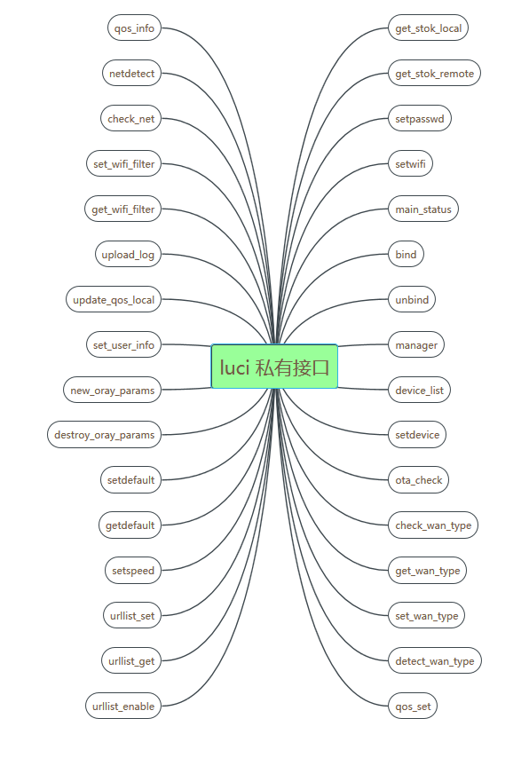
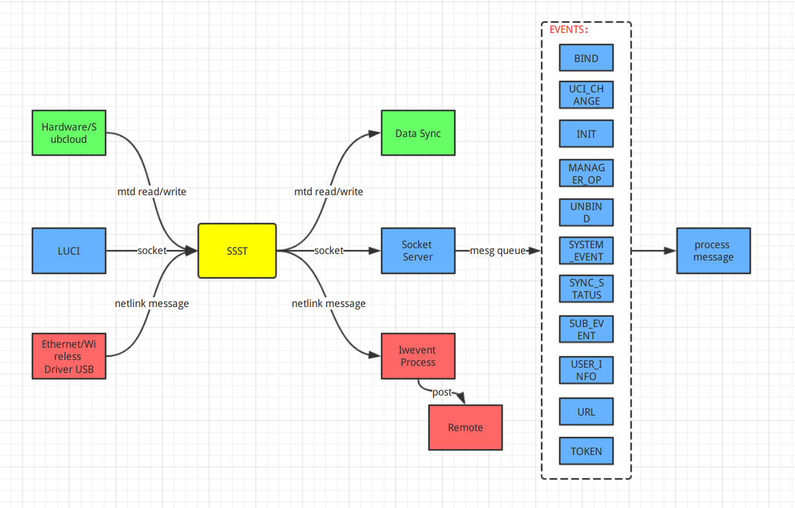
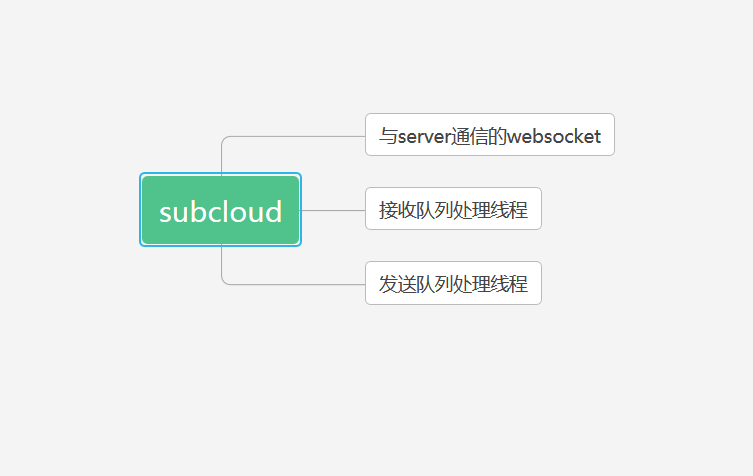
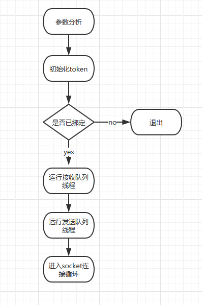
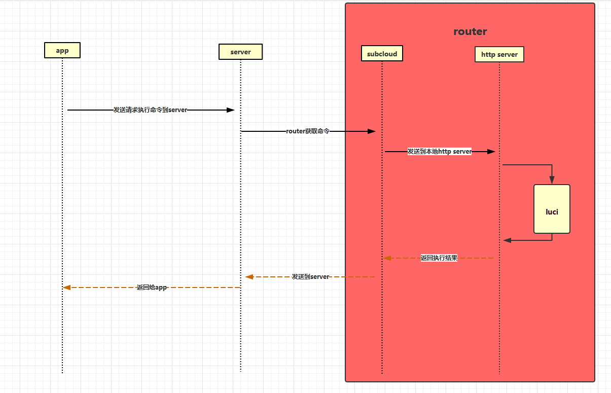

# SIWIFI 服务

---

## 1 整体功能介绍
SIWIFI服务是矽路由解决方案中路由端功能实现部分，为移动设备端App提供丰富的功能支持，包括设备上下线、家长管控、设备信息管理、网络管理、私有云文件管理等多种服务，与App、服务器合作运行致力于为用户提供更好的路由设备使用与管理体验。
## 2 服务组成
### 2.1 luci siwifi 私有接口
#### 2.1.1 功能介绍
SIWIFI服务的功能配置主要由luci siwifi 私有接口和ssst服务组成，大部分功能配置由luci siwifi 私有接口实现。App的所有请求最后都会转变为调用luci 中相关的接口。
#### 2.1.2 软件结构


#### 2.1.3 设备信息管理机制
每个连接到router的设备都会在相关的配置文件（无线和有线设备分别有一个配置文件）中有一个设备节点，节点中储存设备的大部分配置信息，设备的限时和黑白名单功能有自己的配置文件。

```
无线设备配置文件 /etc/config/wldevlist
有线设备配置文件 /etc/config/devlist
限时功能配置文件 /etc/config/timelist
黑白名单配置文件 /etc/url_list
```

设备信息示例：

```
"hostname": "android", //设备实际接入名称
"nickname": "xxxxx", // 修改备注后名称
"mac": "CC:2A:60:D0:62:EE", //设备mac地址
"online": 0, //是否在线
"ip": "191.167.30.237", //设备ip地址
"port": 0,//设备连接类型，1为有线,0为无线
"dev": "wlan0",//连接路由器网络端口名称
"internet": 0,//互联网访问模式 0禁止 1允许 2限时模式
"lan": 0,//是否允许接入路由器
"listfunc" : 0  //0 no use 1 使用白名单 2 使能黑名单
"speedlimit" : 0 //是否开启了限速功能
"notify": -1,//上线离线通知
"speedlvl": -1,//网速优先级别
"disk": -1,//访问外接储存设备()
“limitup”: -1//网速上行限制，单位KBytes/s
“limitdown”: -1//网速下行限制，单位KBytes/s
"maxdownloadspeed": "76395",//最大下载速度
"uploadtotal": "1130816",//上传总流量Bytes
"upspeed": "29",//实时上传速度,单位Bytes/s
"downspeed": "-1",//实时下载速度.单位Bytes/s
"associate_time": "19069",//本次连接时间
"maxuploadspeed": "30289",//最大上传速度
"downloadtoal": "1612667"//下载总流量Bytes
```

每次设备上下线都会触发设备的信息更新，流量统计由内核模块sf-ts负责，在每次App请求设备状态时会从/proc/ts 文件读取流量统计信息。
#### 2.1.4 版本检查机制
App的请求都会带有一个版本号，本地接口在处理请求之前会和路由的本地版本号进行对比，如果请求的版本号大于本地支持的版本号，则返回请求的版本不支持。
#### 2.1.5 功能接口
功能的具体介绍参考SIWIFI本地接口文档.
### 2.2 ssst 服务

#### 2.2.1 功能介绍
  ssst是本地消息处理的主要承担者。它向上承接LUCI、驱动等发出的各种事件，向下负责路由器基本信息的同步，本地状态数据同步、通知远程服务等。

#### 2.2.2 软件结构
  ssst以单包形式编译进openwrt，以多线程为核心，监听处理多种本地事件并通知给远程，整体框架图如下：
  

#### 2.2.3 启动初始化介绍
  ssst为自启服务，初始化时通过读取配置文件获取远程IP与port对接远程服务器；初始化各配置文件，创建3个线程分别处理：远程路由器基本信息同步；本地事件监听处理；热插拔事件，上下线通知；同时启动p2p服务。

#### 2.2.4 siwifi 私有功能介绍
  p2p服务。（P2P介绍 @沈城 @郭喜俊）

设备上下线监听机制：
siwifi监听三个事件来判断设备上下线，无线设备根据mac80211发送的设备上下线事件，有线设备根据网口状态变化的中断事件触发有线设备扫描程序，另外再监听内核arp表的状态变化信息。


### 2.3 subcloud 服务
#### 2.3.1 功能介绍
subcloud服务用来转发远端App的请求到本地http服务器，当App连接矽路由wifi时，请求是直接发送到路由http服务的，但是当App连接的是其他的wifi或使用数据流量时，请求是先发送到服务器，然后由服务器发送到subcloud服务。
#### 2.3.2 软件结构

#### 2.3.3 服务器通讯介绍
subcloud 会一直维护与服务器的连接，根据定期的时钟滴答进行确认，当时钟滴答超时时会进行重连操作。当服务器上有App请求指令时会发送到subcloud，subcloud完成相应的指令后会通过一个socket返回到服务器指定的url路径。
##### 2.3.3.1初始化流程



#### 2.3.4 远程命令执行流程



### 2.4 家长管控功能
#### 2.4.1 功能介绍
家长管控是为了让家长能对孩子上网的时间和内容进行控制而设计的功能，为孩子的健康上网提供安全保障。时间控制可以让设备在指定的时间段有上网权限，设备限速可以对上行下行速度分别限制，黑白名单可以指定是工作在白名单或者黑名单模式，并且是基于每个设备独立设置，白名单模式只有在列表中的网站才可以访问，黑名单模式会屏蔽所有在列表中的网站。
#### 2.4.2 软件设计
##### 2.4.2.1 上网时间控制
时间控制是使用crond实现，每个时间段设置两条规则，第一条用于禁止设备上网，第二条在该时间段结束是用于恢复设备上网权限。对设备的上网权限的实现是基于iptables和ipset，iptables用于配置firewall根据集合DROP指定设备的数据包，ipset根据设备MAC地址创建集合。

```
 /*aclscript 为接入控制脚本*/
 0 20 * * * aclscript c_net $mac 0 
 0 7 * * * aclscript c_net $mac 1
 ipset create forwardvar hash:mac
 iptables -I forwarding_rule -m set --match-set forwardvar src -j DROP
```
##### 2.4.2.2 设备限速
设备限速是使用tc实现，hook点为br-lan，下行流量直接在br-lan进行限制配置，上行流量需在br-lan重定向到辅助设备ifb0，在ifb0上进行限制配置。qdisc采用htb分类队列，过滤器采用基于MAC地址的分流，这样可以保持对设备的识别是唯一的，每个class下接一个无类别队列sfq用来平衡会话流量。

```
tc class add dev br-lan parent 1: classid 1:$id htb rate ${downspeed}kbps ceil ${downspeed}kbps
tc filter add dev br-lan parent 1: prio $id protocol all u32 match ether dst $mac flowid 1:$id
tc qdisc add dev br-lan parent 1:$id handle 10$id: sfq perturb 10
tc class add dev ifb0 parent 1: classid 1:$id htb rate ${upspeed}kbps ceil ${upspeed}kbps
tc filter add dev ifb0 parent 1: prio $id protocol all u32 match ether src $mac flowid 1:$id
tc qdisc add dev ifb0 parent 1:$id handle 10$id: sfq perturb 10
```

##### 2.4.2.3 黑白名单控制
#### 2.4.3 命令执行和数据持久化存储机制

pctl是上网时间控制和设备限速的配置脚本。使用方式如下：


```
#mac format AA:BB:CC:DD:EE:FF //mac 地址为大写 
#param:
pctl time $action(add/del/update/acl) $mac time $starttime $stoptime $week time $starttime $stoptime $week...... //支持多个时间段一起设置
pctl speed $action(add/del/update) $mac $upspeed $downspeed

```

init_pctl用来在系统启动时初始化上网时间控制和设备限速的系统环境，并生效上次运行时的配置。
sync_acl用来当系统时间发生同步时进行设备的上网时间控制状态同步，当系统时间重新设定后，可能会发生设备的禁止上网权限已不在禁止时间段内，或相反情况，所以需要对状态进行一次同步。
