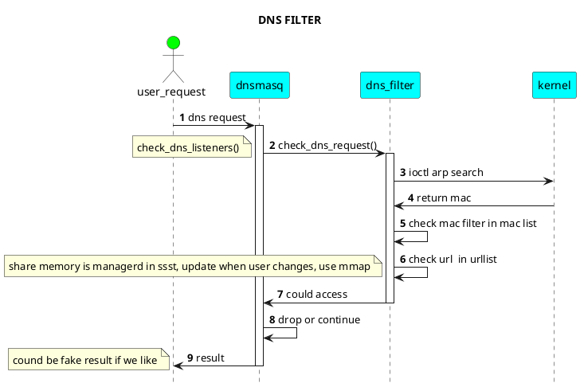
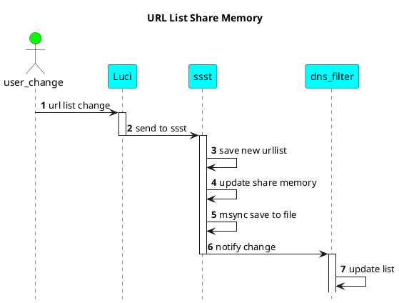
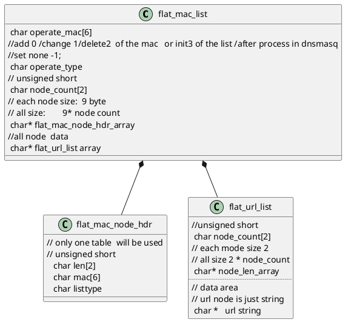
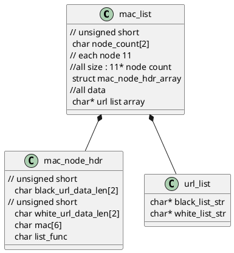

# DNS 过滤插件

增加ipset配置（所有使能黑白名单功能的mac地址），配合iptable规则，将所有对于53端口的请求，强制转发到本地dnsmasq

dnsmasq对于dnsrequest的处理

插件流程如上图所示

TODO:如何动态更新dnsmasq中的urllist
使用mmap的方式，ssst管理一块 mac list 和 urllist， dns filter 直接使用list进行 mac和url的匹配
url 使用子串匹配的方式进行过滤。

最终数据msync 的方式保存到实际文件中去。解决永久保存问题。

ssst 使用signal 通知dns filter 更新 内部list

url list配置直接写入文件

mmap file 中的数据结构
主要是讲mac 和url 两个链表结构的数据进行了扁平化处理。

mac list size is the mmap file size
data used in ssst and dnsmasq

data saved in ssst

