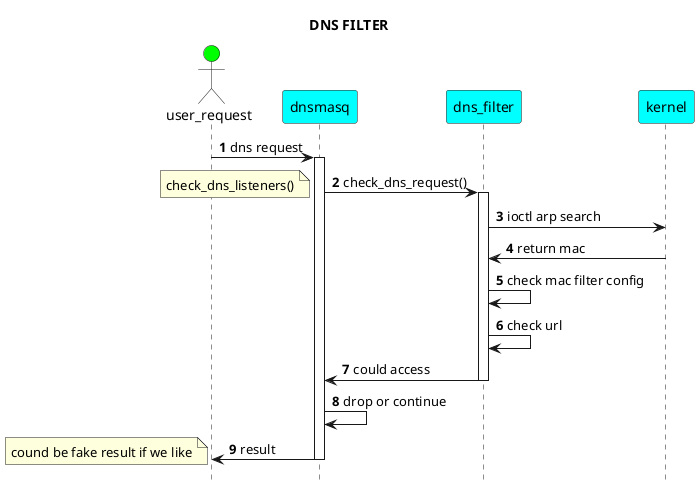

# DNS 过滤插件

```puml
@startuml
hide footbox
title DNS FILTER
actor user_request #Lime
participant dnsmasq #Cyan
participant dns_filter #Cyan
participant kernel #Cyan

autonumber
user_request-> dnsmasq: dns request
activate dnsmasq

dnsmasq -> dns_filter : check_dns_request()
note left:check_dns_listeners()
activate dns_filter

dns_filter->kernel :  ioctl arp search

kernel-> dns_filter : return mac

dns_filter->dns_filter : check mac filter config
dns_filter->dns_filter : check url

dns_filter-> dnsmasq: could access
deactivate dns_filter

dnsmasq-> dnsmasq:drop or continue

dnsmasq->user_request: result
deactivate dnsmasq
note left:cound be fake result if we like

@enduml
```

插件流程如上图所示

TODO:如何动态更新dnsmasq中的urllist
目前想法是在ssst中建立一个share memory, 通过某种方式共享给dnsmasq，ssst 负责管理urllist memory
