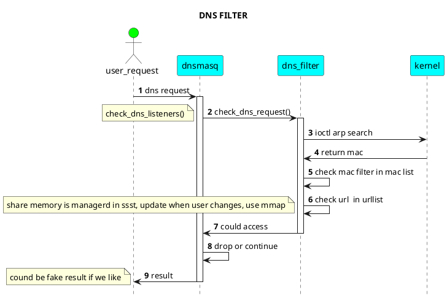
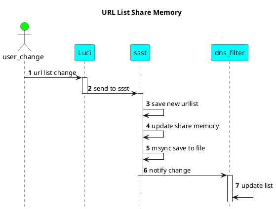

# DNS 过滤插件

增加ipset配置（所有使能黑白名单功能的mac地址），配合iptable规则，将所有对于53端口的请求，强制转发到本地dnsmasq

dnsmasq对于dnsrequest的处理

插件流程如上图所示

TODO:如何动态更新dnsmasq中的urllist
使用mmap的方式，ssst管理一块 mac list 和 urllist， dns filter 直接使用list进行 mac和url的匹配
url 使用子串匹配的方式进行过滤。

最终数据msync 的方式保存到实际文件中去。解决永久保存问题。

ssst 使用signal 通知dns filter 更新 内部list

url list配置直接写入文件

