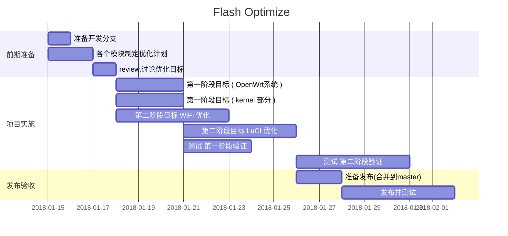

#flash优化计划

TAG: openwrt linux memory

---
[toc]

##现有情况

 - 分区划分

| 分区名        | 大小   |
| --------   | -----:  |
| UBOOT SPL| 128K|  
| UBOOT        |   384K   |
| UBOOT ENV |    64K   |
| FACTORY|    64K   |
|SYSTEM|   15744K|
|SUM|   16384K|

 - 镜像大小

| 分区       | 镜像| 大小   |
| --------   | ------- |-----:  |
| UBOOT SPL| u-boot-spl.img|  62090|
| UBOOT |    u-boot.img   | 319883|
|FIRMWARE | openwrt-siflower-sf16a18-mpw0-squashfs-sysupgrade.bin |8650756|

 u-boot-spl.img 进行了补0，填充到了128K
 u-boot-spl.img + u-boot.img 组成了 uboot_full.img

 - 启动后

<table class="inline">
	<tbody><tr class="row0">
		<th class="col0"> Layer0 </th><td class="col1 centeralign" colspan="8">  raw flash 16M </td>
	</tr>
	<tr class="row1">
		<th class="col0"> Layer1 </th>
		    <td class="col1 centeralign" rowspan="1" colspan="3">  uboot  partitions  </td>
            <td class="col2 centeralign" rowspan="3" colspan="1"> <strong><code>mtd3</code></strong> factory  64K</td>
            <td class="col3 centeralign" colspan="3">  <strong><code>mtd4</code></strong>  firmware  15744K </td>
	</tr>
	<tr class="row2">
		<th class="col0"> Layer2 </th>
		    <td class="col1 centeralign" rowspan="2" > <strong><code>mtd0</code></strong>   spl_loader  128k  </td>
		    <td class="col2 centeralign" rowspan="2">  <strong><code>mtd1</code></strong>   uboot  384K    </td>
		     <td class="col3 centeralign" rowspan="2">  <strong><code>mtd2</code></strong>   uboot_env  64k   </td>
		    <td class="col4 centeralign" rowspan="2">   <strong><code>mtd5</code></strong>   kernel   1477K   uImage_lzma</td>
		    <td class="col5 centeralign" rowspan="1" colspan="2">  <strong><code>mtd6</code></strong>
		     rootfs  14267K mounted: "<code>/</code>" </td>
	</tr>
	<tr class="row3">
		<th class="col0"> Layer3 </th>
		    <td class="col1 centeralign" colspan="1">                                                          <strong><code>/dev/root</code></strong>  
                mounted: "<code>/rom</code>" 5371K 
                 root.squashfs (increase in 256K for mkfs with block size 256K)
            </td>
            <td class="col2 centeralign"  colspan="1">             
                <strong><code>mtd7</code></strong>   rootfs_data   8896K 
                mounted: "<code>/overlay</code>"  
                used:632K
            </td>
	</tr>
</tbody></table>

##优化目标
最终目标为4M flash。分区划分情况如下：

 - 分区划分

| 分区名        | 大小   |
| --------   | -----:  |
| UBOOT SPL| 32K|  
| UBOOT        |   164K    |
| UBOOT ENV |    4K    |
| FACTORY|    4K   |
|SYSTEM|   3896K|
|SUM|   4096K|

结合目前调研看到的一些镜像数据。
编译的镜像大小

 - 镜像大小

| 分区       | 镜像| 大小   |
| --------   | ------- |-----:  |
| UBOOT SPL| u-boot-spl.img|  32K|
| UBOOT |    u-boot.img   | 164K|
|FIRMWARE | openwrt-siflower-sf16a18-mpw0-squashfs-sysupgrade.bin |3000K|      

余下空余空间896K
系统镜像中，其中
kernel 需要小与   1200K
root-fs 需要小于  1800K

###各个模块优化

根据重点的几个模块，列出下面优化的一些重点方向

WiFi 优化
wifi 系统整体占用空间较大，需要进行优化。

OpenWrt系统优化
移除不需要的网络组件，ipv6等

kernel优化
移除不需要的内核模块
重点关注一些可以减少kernel size的宏 比如CONFIG_KALLSYMS

LuCI 优化
由于lua是没有经过编译的文件，如何可以减少不必要lua代码，可以有效较少系统size

###TODO

 - 采用什么方式定义此方案，以单独配置文件方式，还是采用单独分支。（配置文件是否可以满足需求）
 - 如何保证在flash过小的情况下，不会出现由于剩余空间耗尽导致系统程序无法启动。

##优化计划

开发时间总计18天(未包含周末时间)

